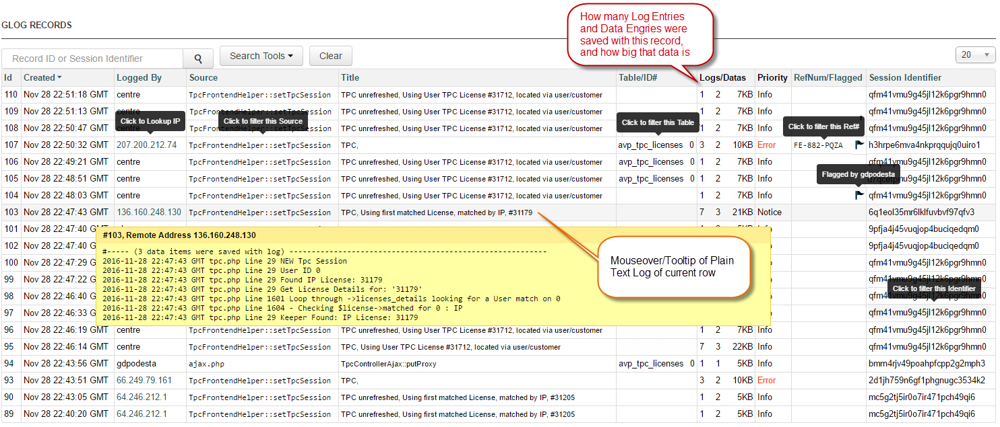
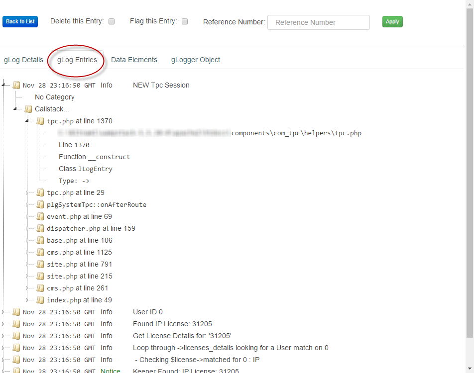
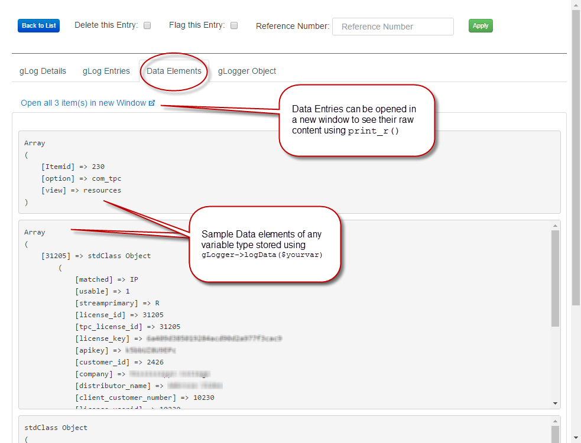
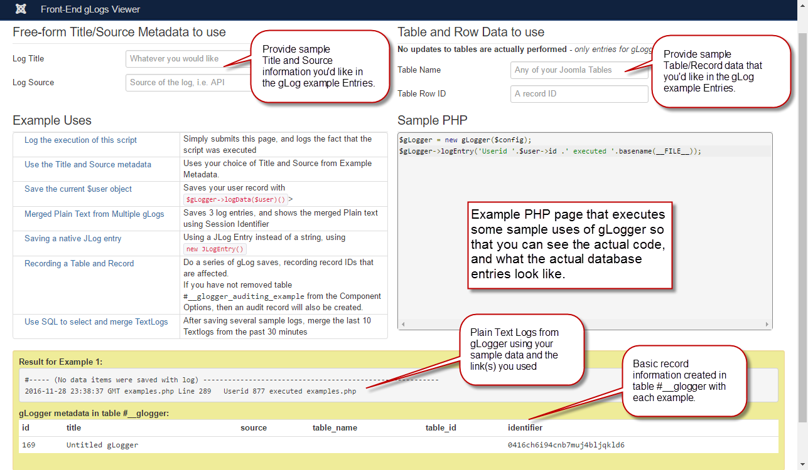

# glogger: Extended Joomla Logging Tool

gLogger started as a simple class to extend the standard JLog class so that the logging information was saved in a table rather than in text files scattered around the \logs folder.  Initially, it just stored standard data so that I could view in a single place.  I quickly realized that all sorts of other pertinant data was available, and that may other functions could be incorporated.

<h2>The Problem</h2>

Our environment involves updates being made to our tables from locations that range from Seattle to Western Europe.  Those updates are done via Joomla Forms, API calls, cURL, as well as a variety of overnight jobs that do mass updating.  There are potentially dozens of IDs from dozens of table that are all correlated in some way or another. To futher complicate it, most of the activity is done without direct User Authentication.  Their IP is link to a User or to an Account, and that activity also has to be considered in the looking at the activity logs.

Trying to pin down when or where a particular table was being updated (and how) was becoming a nightmare using JLog because it simply writes entries to a text file, giving us thousands of log entries per week in an uncontolled list of text files.  These JLog entries are mixed in with entries from other un-related components that also do logging, so it would often take hours to sift through them.  We had to weed out unwanted IP addresses, consider timezones, unrelated components, and finally gather up the sequence of events to isolate the actual event that I/we were interested in.

<h2>The Solution</h2>
gLogger simply extends the JLog class, and adds a new method 

Native JLog code (to write a line to error.php):
<pre>
$entry = new JLogEntry("Some text to log", JLog::INFO);
$logger->addEntry($entry);
</pre>

gLogger code (to save a line to the gLogger Object):
<pre>
$gLogger = new gLogger();
// Log some text
$gLogger->logEntry("Some text to log",$JLog::INFO);

// Save a variable to the gLogger Object
$gLogger = new gLogger();
$gLogger->logData($myArray);

// Log some more text
$gLogger->logEntry("Some more text to log",$JLog::INFO);

// You can still use native JLog method to write something to error.php
$gLogger->addEntry("Something to write to error.php",$JLog::ERROR);
</pre>

The gLogger methods store everything in the object instead of immediately writing it to a text file.  When the gLogger is destroyed at the end of the script, all the text and data saved along the way is saved in a single database record.  Along with the text and data, is other metadata, such as :
<ul>
<li>The source of the log</li>
<li>A title of your choosing</li>
<li>Userid</li>
<li>The remote IP address</li>
<li>Full backtrace/callstack leading up to where the gLogger method is used</li>
<li>Joomla Session ID</li>
<li>Optional Table Name</li>
<li>Optional Table Row ID</li>
</ul>

So, at the end of this script, instead of a text file <em>probably</em> (but not necessarily) called error.php, is a single row in the database that contains anything you could possible need to see what happened along the way - <u>and all searchable with SQL</u> instead of a text file editor.  In my case, I use SQL to see all the activity in a particular Joomla session: before, during, and after they were logged in.  I can see what tables were affected, or if unexpected results occurred - all in seconds, not hours, by merely slicing and dicing with SQL statements.  Additionally, each row can be Flagged by authorized gLog users, or have a Reference Number (such as a support ticket number) added to it for futher SQL refinement.

<h3>Audits and Alerts</h3>

The gLogger table is self cleaning, because give then amount of data that can be stored, and the number of entries, it has the potential of growing rather large and rather quickly.  To account for that, the option to save "Audit copies" of gLogger entries in a separate table has been added.  The Component Options allows you to specify which tables should be audited, and when a gLogger entry is made that has a Row # for any of those tables, the record is stored in <code>#__glogger_audit</code> as well as <code>#__glogger</code>.  Records in <code>#__glogger_audit</code> are never automatically deleted.

You can also configure an email address to send an alert to if any of the specifed Priorities are logged: 
<ol>
<li>Emergency</li>
<li>Alert</li>
<li>Critical</li>
<li>Error</li>
<li>Warning</li>
<li>Notice</li>
<li>Info</li>
<li>Debug</li>
</ol>

<h2>The Component</h2>

The installation package installs the gLogger Library (a single php file), as well as the UI Component.  It is not a component that serves any purpose for a general user, so makes some assumptions about the technical abilities of anyone using it.

The initial solution began as a simple extension to JLog.  I then used a well known free component creator to generate a UI so that I could easily view and organize the output.  The generated code has some inherent glitches, so I patched those as I encountered them, and began a series of code/style experiments to see what would improve it for my use. In short, it was never "designed", but has been a series of tweaks and experiments to see how I might make the UI more useful in various ways.

Please don't judge me based on the guts of this thing, I did it all over the Thanksgiving break, lol.  Judging by the near zero interest in the JSE question that prompted it, I'd be surprised if anyone ever uses it, but if there is any serious interest in using it, I'd like to refactor some things and clean up the code

<strong>Main gLogger Listing View</strong> Allows sorting/filtering/selelection of all gLog records in the database.
  

<strong>gLog Details</strong> The basic information about the gLogger record, and the Plain Text consolition of it's entries
  

<strong>gLog Entries</strong> Each gLog Entry shown wtih jsTree, including the full backtrace of each call
  

<strong>Data Elements Listing View</strong>  If you add any data to the gLogger using <code>->addData()</code>, then it each is displayed here
  

<strong>gLogger Object</strong> The full gLogger object displayed using <code>print_r()</code>
  

<strong>External Window for viewing Large Objects</strong> If there are a lot of Log Entries, or large/complex data items, this window can be opened to view them in their entirety using <code>print_r()</code>
  

<strong>gLogger Configuration Options</strong> Standard Joomla Component Options
  

<strong>Component Documentation - Data and Methods</strong> Documentation of gLogger Data and Methods (<em>very much a work in progress</em>)
  

<strong>Component Documentation - Uses and Helper Function</strong> Documentation of gLogger Uses and Helper Function (<em>very much a work in progress</em>
  

<strong>Examples PHP page</strong> Working PHP script and links using the gLogger class that shows the code used and the resulting Logss and database entries  (<em>very much a work in progress</em>
  

